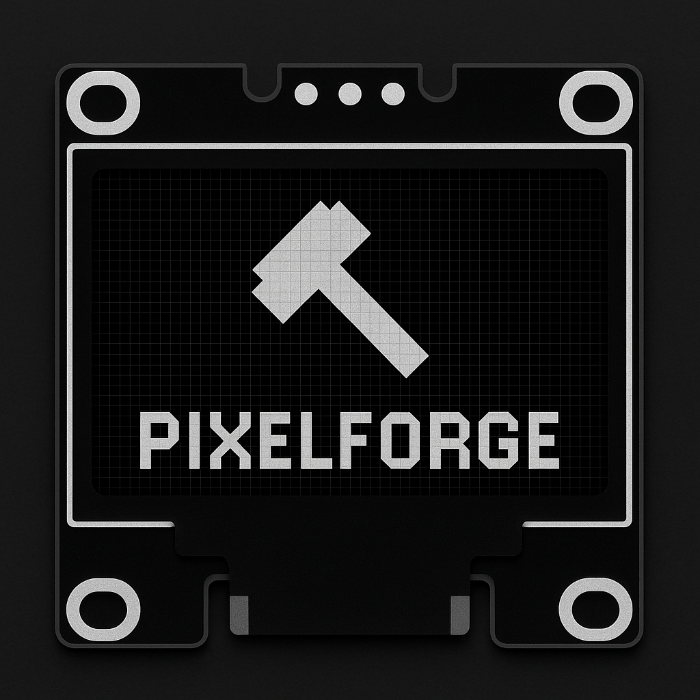

# PixelForge



[](LICENSE)
[](#)
[](#)
[](https://www.electronjs.org/)
[](https://p5js.org/)

> A precision-crafted pixel editor and code generator for SSD1306 OLED displays. Built for embedded developers, hardware engineers, and creative makers.  
> Instantly export clean Adafruit GFX code directly into your microcontroller project.

GitHub Repository: [https://github.com/jacobbarglof/SSD1603-PixelForge](https://github.com/jacobbarglof/SSD1603-PixelForge)


---

# INSTALLATION INSTRUCTIONS

## Requirements

To run or build PixelForge, ensure the following are installed on your system:

* **Node.js (v16 or higher)**
* **npm (Node Package Manager)**
* **Electron** (installed via npm)

---

## Quick Install and Build

### 1. Clone the repository

```bash
git clone https://github.com/jacobbarglof/SSD1603-PixelForge.git
cd SSD1603-PixelForge
```

### 2. Install dependencies

```bash
npm install
```

This command installs all required packages listed in `package.json`, including:

* **electron**: core framework for the desktop app
* **electron-builder**: for packaging and distributing the app
* **p5.js**: canvas rendering and graphics

### 3. Start the app in development mode

```bash
npm run start
```

This will open the PixelForge app in a desktop window.

### 4. Build a distributable version

```bash
npm run dist
```

The installer will be generated in the `dist/` directory. Depending on your OS, you’ll find a `.exe`, `.dmg`, or `.AppImage` file.

---

## File Directory Structure

Navigate to the root project folder (`SSD1603-PixelForge/`) and understand the structure:

```
SSD1603-PixelForge/
├── assets/                  → Logo, splash, and background images
├── build/                   → App icons (.ico, .icns, .png)
├── dist/                    → App builds and installers
├── index.html               → Main UI shell
├── style.css                → Application styling
├── script.js                → Drawing engine (p5.js based)
├── main.js                  → Electron entry point
├── package.json             → Metadata and build configuration
└── README.md                → You’re reading it
```

Run all commands (e.g., `npm install`, `npm run dist`) **from this root folder.**

---

## Features

* Clean pixel-accurate canvas
* Tools for drawing pixels, lines, rectangles (filled and unfilled), circles, triangles, polygons, and text
* Instant Adafruit GFX C++ code generation
* One-click export or copy to clipboard
* Ruler ticks and mouse coordinate preview
* Zoom support and subtle crosshair for precision
* Save as standalone app (`.exe`, `.dmg`, `.AppImage`) using Electron

---

## Usage

* Use the toolbar to select a drawing tool
* Draw shapes directly on the canvas
* Switch between white or black color using the dropdown
* View coordinates and ruler guides while hovering
* Click Export Code to generate Arduino-compatible GFX code
* Copy or paste the result into your firmware project

---

## Example Output

```cpp
display.drawPixel(32, 20, SSD1306_WHITE);
display.drawLine(0, 0, 127, 63, SSD1306_WHITE);
display.setTextSize(1);
display.setTextColor(SSD1306_WHITE);
display.setCursor(10, 10);
display.print(F("Hello OLED"));
```

---

## Behind the Scenes

PixelForge uses:

* p5.js for pixel-level canvas drawing
* Electron for desktop app delivery
* Built-in font data for ASCII-rendered OLED characters
* Live GFX syntax conversion from drawn shapes

---

## Credits

* Generation engine based on [arduino-gfx-generator](https://github.com/haroonalisa/arduino-gfx-generator) by Haroonalisa
* Inspired by tools like Adafruit's GFX library and OLED playgrounds

---

## License

This project is licensed under the MIT License.
See the LICENSE file for full terms.

---

---

## Contact

Have suggestions, issues, or want to contribute?
Open an issue on GitHub or start a discussion.

GitHub Repository: [https://github.com/jacobbarglof/SSD1603-PixelForge](https://github.com/jacobbarglof/SSD1603-PixelForge)
